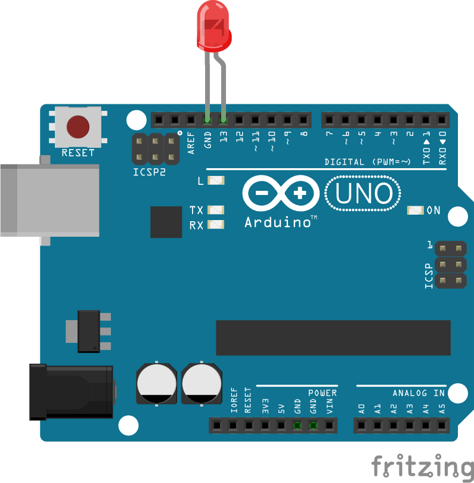

title: Sobre o Átila

* Graduando em Ciência da Computação pelo IFCE Campus Maracanaú.
* 8 anos de experiência com Linux.
* Organizador do COMSOLiD a 6 anos.
* Aficcionado por JavaScript.

---

title: Sobre o Samir

* Graduando em Ciência da Computação pelo IFCE Campus Maracanaú.
* Organizador do COMSOLiD a 6 anos.
* Programador desde menino (1900 e não interessa...).
* Gosta de estudar novas tecnologias.

---

title: Introdução
content_class: flexbox vcenter

Um dos objetivos da tecnologia é prover **Automatização**.

---

class: segue nobackground fill
image: img/arduino-logo-wallpaper.jpg

---

title: Anatomia
class: segue nobackground fill
image: img/arduino-uno.jpg

---

title: Arduino Starter Kit
content_class: flexbox vcenter

### **USD 39,00** ou **R$ 100,70**

---

title: Outros componentes

* Wi-Fi e Ethernet
* Sensores de Força, Luz, Temperatura, Presença, Proximidade, Toque, Pressão
* Led
* Botões
* EEPROM
* GSM
* Piezo
* LCD
* RFID

---

title: JavaScript
class: segue nobackground fill
image: img/javascript-logo-wallpaper.jpg

---

title: JavaScript

Criado em 1995 por Brendan Eich, na NetScape.

Originalmente foi criado para dar vida as páginas web.

Em 2009 nasceu o NodeJS, uma forma de executar JavaScript fora do browser.

---

class: segue nobackground fill
image: img/nodejs-logo-wallpaper.jpg

---

title: NodeJS

Criado por Ryan Dahl, é uma ambiente de execução multi-plataforma,
de código aberto para aplicativos JavaScript no lado do servidor.

## Instalação

<pre>
$ sudo apt-get install nodejs
</pre>

Instala o `node` (ambiente de execução) e o `npm` (instalador de módulos)

---

class: segue nobackground fill
image: img/cylon-logo-wallpaper.jpg

---

title: Cylon.js

Cylon.js é uma framework javascript para robôs, física computacional, e
Internet das Coisas. 

Plataformas suportadas:

* Arduino
* Beaglebone
* Intel Edison
* Leap Motion
* OpenCV
* Raspberry Pi
* Tessel, entre outras.

---

title: Cylon.js - Exemplo

## Instalação

<pre>
$ mkdir project
$ cd project
$ npm init
$ npm install cylon cylon-firmata --save
$ node index.js
</pre>

---

title: Cylon.js - Exemplo

<pre class="prettyprint" data-lang="javascript">
var Cylon = require("cylon");

Cylon.robot({
  connections: {
    arduino: { adaptor: 'firmata', port: '/dev/ttyUSB0' }
  },

  devices: {
    led: { driver: 'led', pin: 13 }
  },

  work: function(my) {
    every((1).second(), function() {
      my.led.toggle();
    });
  }
}).start();
</pre>

---

class: segue nobackground fill
image: img/johnny-five-logo-wallpaper.jpg

---

title: Johnny-Five

Johnny-Five é uma framework javascript para robôs, Internet das Coisas
desenvolvido na Bocoup.

Plataformas suportadas:

* Arduino
* Beaglebone
* Eletric Imp
* Intel Galileo & Edison
* Pinoccio
* Raspberry Pi, entre outras.

---

title: Johnny-Five - Exemplo

## Instalação

<pre>
$ mkdir project
$ cd project
$ npm init
$ npm install johnny-five --save
$ node index.js
</pre>

---

title: Johnny-Five - Exemplo

<pre class="prettyprint" data-lang="javascript">
var five = require("johnny-five"),
  board, led;

board = new five.Board();

board.on("ready", function() {

  // Create a standard `led` hardware instance
  led = new five.Led(13);

  // "strobe" the led in 100ms on-off phases
  led.strobe(100);
});
</pre>

---

title: Johnny-Five - Exemplo
content_class: flexbox vcenter

---

title: Entretanto...
content_class: flexbox vcenter

Cylon.js e Johnny-Five ainda não dão suporte a infravermelho!

O que fazer para contornar isso?

(Por enquanto...)

---

title: Controle Remote Infravermelho
class: segue nobackground fill
image: img/popcorntime-ir-remote.jpg

---

title: Controle Remote Infravermelho

Para nosso exemplo vamos usar um Controle Remote Infravermelho para
controlar o **Popcorntime**, uma aplicativo que permite assistir Filmes,
Séries e Animes através de stream de torrent.

---

title: Controle Remote Infravermelho
subtitle: Como isso é feito?

Precisamos primeiro capturar os dados enviados pelo controle e decodificá-los.

Após decodificação, é necessário enviar para a porta serial qual o comando
para aquele botão.

---

title: Mapeamento dos botões
class: nobackground fill
image: img/rc4pt-arduino-mapeamento-botoes.png

---

title: Enviando comandos para porta serial
class: nobackground fill
image: img/rc4pt-arduino-ide.png

---

title: Usando 'serialport' para ler da porta serial

<pre class="prettyprint" data-lang="javascript">
'use strict';

var api = require('./popcorn/api')
    , com = require('serialport');

var serialPort = new com.SerialPort('/dev/ttyUSB0', {
    baudrate: 9600,
    parser: com.parsers.readline('\r\n')
});

serialPort.on('open',function() {
    console.log('Port open');
});
</pre>

---

title: Usando 'serialport' para ler da porta serial

<pre class="prettyprint" data-lang="javascript">
serialPort.on('data', function(data) {

    function callback(error, response, body) {
        if (!error && response.statusCode === 200) {
            api.parseAndSend(data);
        } else {
            console.log(error);
        }
    }

    api.send('ping', [], callback);
});
</pre>

---

title: Fazendo parse dos comandos lidos da serial

<pre class="prettyprint" data-lang="javascript">
if (<b>/^rc4pt:(.*)$/</b>.test(value)) {
    /* ... */
    this.send('getviewstack', [], function(error, response, data) {
        if (!error && response.statusCode === 200) {
            /* ... */
            switch (currentView) {
                case <b>'main-browser'</b>:
                    self.handleMainBrowser(cmd);
                    break;
                case <b>'player'</b>:
                    self.handlePlayer(cmd);
                    break;
				/* ... */
            }
        }
    });
}
</pre>

---

title: Fazendo parse dos comandos lidos da serial

<pre class="prettyprint" data-lang="javascript">
Api.prototype.handlePlayer = function(cmd) {
    switch (cmd) {
        case <b>'play-pause'</b>:
            this.send('toggleplaying');
            break;
        case <b>'func-stop'</b>:
            this.send('togglefullscreen');
            break;
        case <b>'down'</b>:
            this.send('back');
            break;
    }
};
</pre>

---

title: github.com/comsolid/rc4pt-arduino
class: nobackground fill
image: img/rc4pt-arduino-repo.png

---

title: github.com/comsolid/rc4pt-node
class: nobackground fill
image: img/rc4pt-node-repo.png

